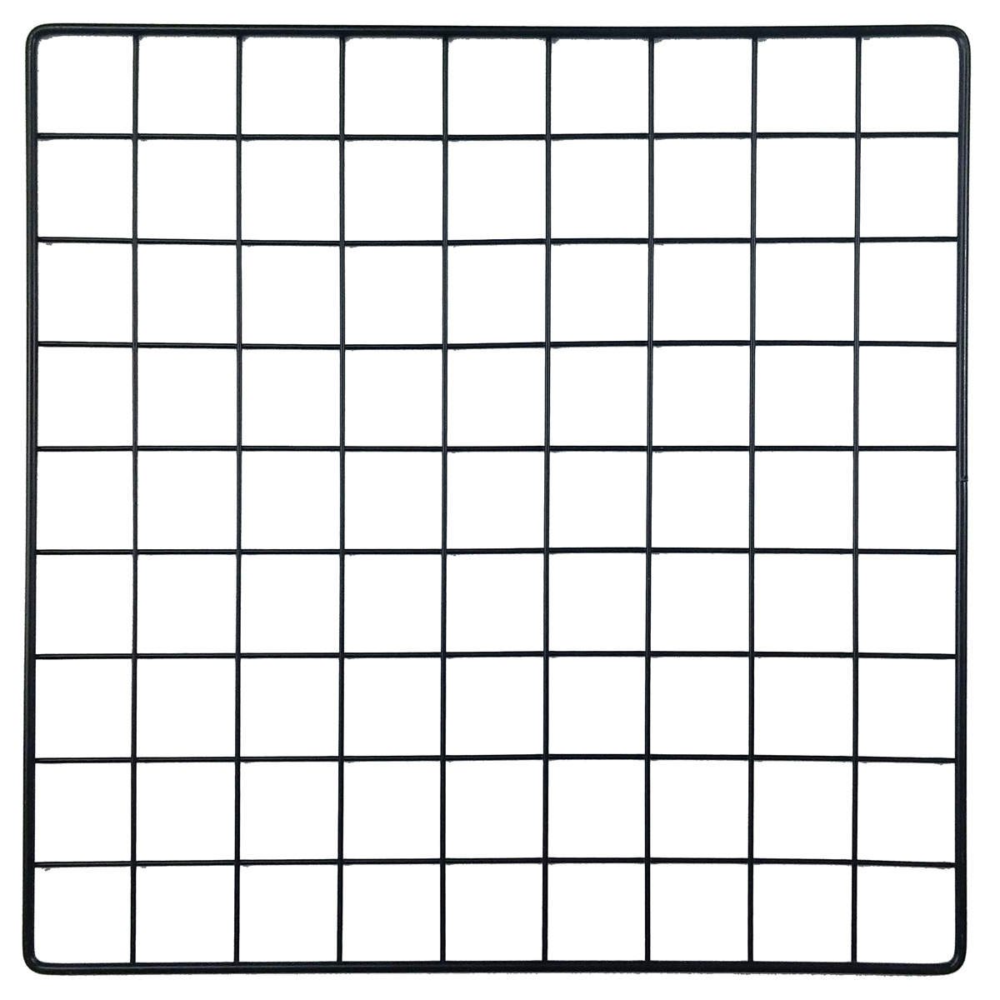

.. Test documentation master file, created by
   sphinx-quickstart on Sun Nov 15 00:56:08 2020.
   You can adapt this file completely to your liking, but it should at least
   contain the root `toctree` directive.

Welcome to the Grid Python Documentation!
=========================================
Guide on How to Create Adjustable Grid
^^^^^^^^^^^^^^^^^^^^^^^^^^^^^^^^^^^^^^

.. toctree::
   :maxdepth: 2
   :caption: Table of Contents:
   
   additional/welcome.rst

Indices and tables
==================

* :ref:`genindex`
* :ref:`modindex`
* :ref:`search`
